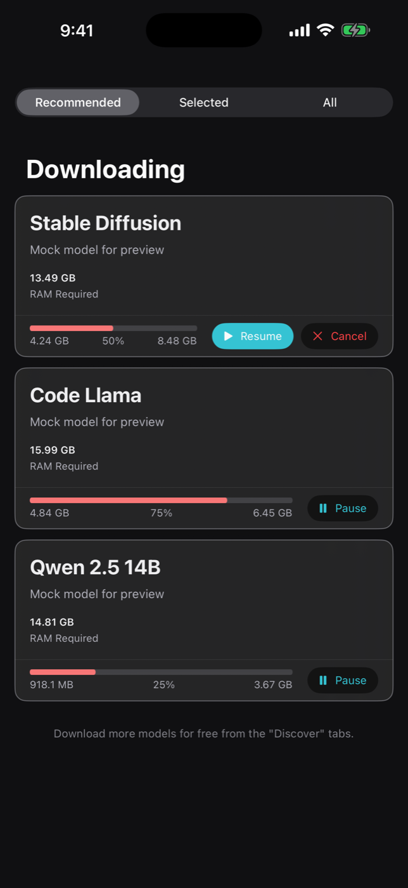
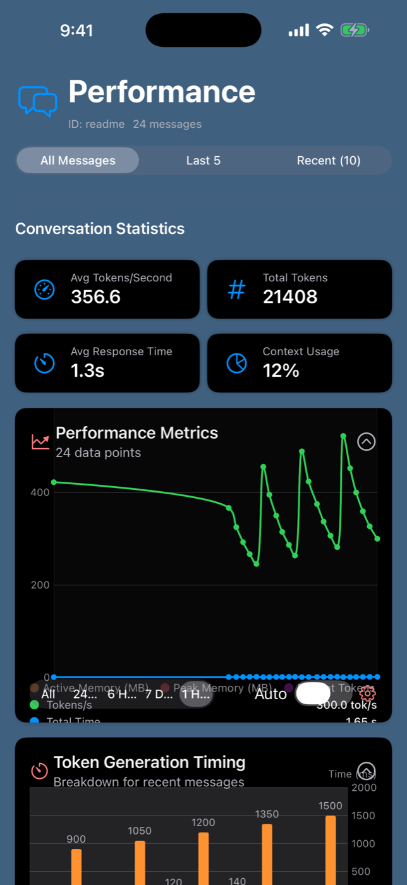
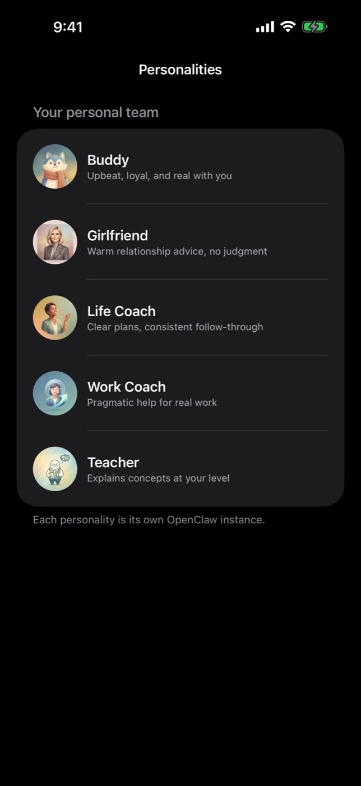

<p align="center">
  
</p>

# Think

**Think** is a fast, privacy-first AI assistant for Apple platforms. Run models locally on-device (MLX / llama.cpp), optionally connect remote providers, and use tools like web search and document retrieval (RAG) from a native SwiftUI app.

**Platforms:** iOS 18+, macOS 15+, visionOS 2+

<p align="center">
  <a href="LICENSE"></a>
  
  
  
</p>

**Quick links:** [Install](#install-from-source) · [Run](#run) · [ThinkCLI](#thinkcli) · [Inference](#inference-modes) · [OpenClaw Gateway](#openclaw-remote-gateway) · [Architecture](#architecture) · [Contributing](CONTRIBUTING.md)

## What You Can Do With Think

- **Chat with local models** on Apple Silicon using **MLX** (on-device) or **llama.cpp** (GGUF).
- **Use optional remote models** (OpenAI, Anthropic, Google Gemini, OpenRouter) when you want cloud capability.
- **Search the web** via built-in browser tools (DuckDuckGo-backed) and extract readable content.
- **Ask questions about your documents** using a Retrieval-Augmented Generation (RAG) pipeline.
- **Generate images** on-device (Core ML pipelines, where supported).
- **Keep secrets safe**: remote API keys and OpenClaw credentials are stored in **Keychain**.

By default, Think is designed to keep your data on-device. Network access is only used when you enable features that require it (for example: remote providers, web search, or model downloads).

## Install From Source

This repository uses a **Makefile-only workflow** for development (do not run from Xcode).

### Requirements

- Xcode 16.2+ with Swift 6 (strict concurrency)
- Apple Silicon Mac recommended (MLX/Metal support)

### Setup

```bash
make setup
make lint
make build
make test
```

## Run

### macOS app

```bash
make run
```

### visionOS app

```bash
make run-thinkVision
```

## Develop A Module

Most packages can be built/tested in isolation:

```bash
cd ViewModels
make lint
make build
make test
```

## Screenshots / Media

<p align="center">
  
  
  
  
</p>

Each personality is its own OpenClaw instance, with its own model choices, tools, skills, and memory.

This repo includes a dedicated screenshot UI harness in `App-Screenshots/`, the test runner in `Screenshots/`, and a script to generate the README images: `scripts/take_readme_screenshots.sh`.

## ThinkCLI

ThinkCLI is a Swift executable named `think` (built with `swift-argument-parser`) that can manage chats, models, tools, RAG, and remote gateway connectivity from the terminal.

### Install (One Command)

This installs `think` into a standard `bin` directory (`/opt/homebrew/bin`, `/usr/local/bin`, or `~/.local/bin` depending on what is writable).

```bash
curl -fsSL https://raw.githubusercontent.com/matiasvillaverde/think/main/scripts/install-think-cli.sh | bash
```

### Install From a Local Clone

```bash
cd ThinkCLI
make install
```

### Quick Usage

```bash
think --help
think doctor
think models list
think chat list
```

## Inference Modes

Think supports multiple inference backends (configured in the app and/or via ThinkCLI):

1. **On-device (MLX)**: optimized for Apple Silicon.
2. **On-device (llama.cpp / GGUF)**: run GGUF models locally.
3. **Remote providers (API key)**: OpenRouter, OpenAI, Anthropic, Google Gemini.
4. **OpenClaw Gateway**: connect to a remote gateway over WebSocket.

Remote API keys (used by ThinkCLI/tests and some scripts):
- `OPENROUTER_API_KEY`
- `OPENAI_API_KEY`
- `ANTHROPIC_API_KEY`
- `GOOGLE_API_KEY` or `GEMINI_API_KEY`

For remote provider details, see `RemoteSession/CLAUDE.md`.

## OpenClaw Remote Gateway

Think can connect to a remote OpenClaw Gateway for “OpenClaw-style” remote operations.

See `OPENCLAW_REMOTE.md` for setup instructions (App UI and ThinkCLI).

## Architecture

Think is organized as a set of Swift packages plus app targets, with protocol-driven boundaries and dependency injection via `Factories/`.

- Modules live at the repo root (for example: `Abstractions/`, `Database/`, `AgentOrchestrator/`, `ViewModels/`, `UIComponents/`, `Tools/`, `RAG/`, `MLXSession/`, `LLamaCPP/`).
- App targets live in `Think/` (iOS/macOS) and `Think Vision/` (visionOS).

- Start here: `AGENTS.md` (architecture + module layout)
- Build/test rules: `CLAUDE.md` (root + module-specific `CLAUDE.md` files)

## Troubleshooting

- MLX/Metal-related modules may fail under `swift test`. Use each module's `make test` (or run from the repo root with `make test`).
- If builds fail after toolchain updates, try `make clean` then `make build`.
- If you hit SwiftLint violations, run `make lint-fix` before re-running `make lint`.

## Documentation Index

- `AGENTS.md`: architecture and module layout
- `CLAUDE.md`: build/test rules and module-specific gotchas
- `CHANGELOG.md`: notable changes (Keep a Changelog format)
- `OPENCLAW_REMOTE.md`: OpenClaw Gateway setup (UI + ThinkCLI)
- `CI.md`: CI/CD workflows and Makefile conventions
- `scripts/.env.example`: App Store / deployment environment template (copy to `scripts/.env` when needed)

## Contributing

See `CONTRIBUTING.md`.

## Security

See `SECURITY.md`.

## License

MIT. See `LICENSE`.
